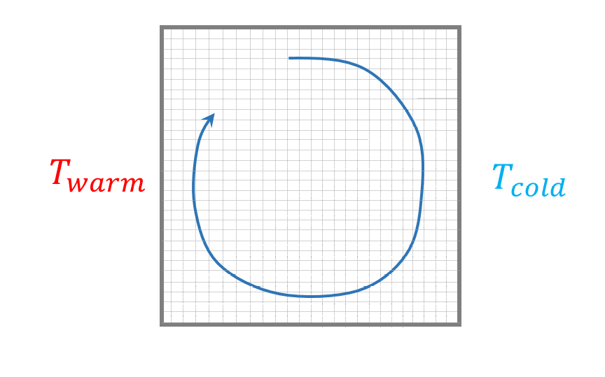

.. raw:: html

    

.. role:: blue

.. raw:: html

    

.. role:: red

HOW TO DEFINE A STATIONNARY TEST-CASE WITH THERMAL EFFECTS ?
==============================================================

L'objectif ici est de mettre en place un cas-test **stationnaire** en prenant en compte, cette fois-ci, des effets thermiques. Pour ce faire, nous repartirons de la fiche :doc:`HowToDefStatCase` a laquelle nous ajouterons du chauffage sur les parois laterales verticales ; la vitesse imposeee sur la paroi superieure sera, quant a elle, supprimee.

On s'attend alors a obtenir un unique grand tourbillon au centre de la cavite.

.. _ma_figure_HowToDefStatCaseWithT_f1.png:

   
   Etat stationnaire attendu pour un ecoulement dans une cavite carree a laquelle un differentiel de temperature est impose entre les 2 parois verticales

Afin de prendre en compte les effets thermiques, il est necessaire d'ajouter l'equation d'Energie au probleme precedent. Il existe de faon de la prendre en compte suivant le rapport de densite entre la temperature la plus chaude et le temperature la plus froide :math:`{\Delta \rho \over \rho_m}`.

Si :math:`{\Delta \rho \over \rho_m} < 0.1` => Approximation de Boussinesq
-------------------------------------------------------------------------------------

* **La physique resolue** : l'activation de l'equation de l'Energie s'effectue en uilisatant le mot cle :blue:`Pb_Thermohydraulique`.
* **Les proprietes des fluides** : les proprietes physqiues sont constantes sauf la densite dans le terme de gravite. On calcule alors les proprietes physiques :math:`\rho_m`, :math:`\nu_m` et :math:`Cp_m `avec la temperature moyenne :math:`T_m`.

.. note::
   L'approximation de Boussinesq contient un terme en :math:`(T_m - T_0)\beta`. Afin d'eviter un changement de signe dans ce terme, il est recommande de prendre pour :math:`T_0` la temperature la plus froide du problemen et non pas la temperature initiale, sinon des problemes numeriques peuvent apparaitre.
   
   Si, lors du calcul, on constate une surestimation des vitesses, celles-ci peuvent etre modulees via ce terme.
   
   Avec cette approximation, on accepte une erreur de 10% sur la dilatabilite du fluide.

* En ce qui concerne les autres etapes, a savoir le maillage, les differents schemas,... les recommandations sont les memes que pour la fiche :doc:`HowToDefStatCase`

Si :math:`{\Delta \rho \over \rho_m} > 0.1` => Quasi-compressible
------------------------------------------------------------------------------

* **La physique resolue** : l'activation de l'equation de l'Energie s'effectue alors en utilisatant le mot cle :blue:`Pb_Thermohydraulique_QC`.
* **Les proprietes des fluides** :  pour definir les proprietes du fluide, il existe plusieurs possibilites : soit definir un gaz parfait, soit definir un gaz reel soit definir rho comme étant une fonction de la temperature, un polynome par exemple. Si cette derniere possibilite est retenue, il faudra neanmoins veiller a ce que la pression soit constante au risque sinon de voir apparaitre des erreurs sur les proporietes physiques.
* En ce qui concerne les autres etapes, a savoir le maillage, les differents schemas,... les recommandations sont les memes que pour la fiche :doc:`HowToDefStatCase`
